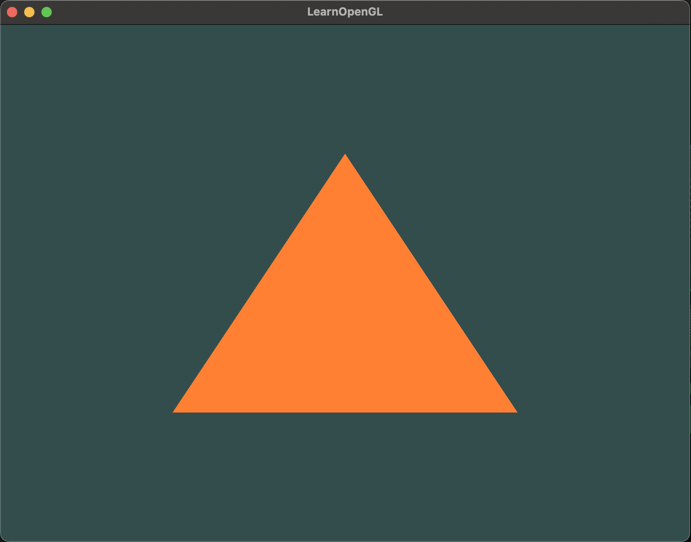
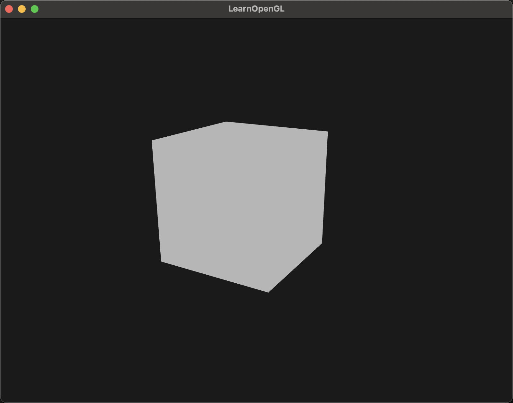

# easy-gl

这是一个面向对象的OpenGL API库，基于lwjgl。

## 本项目的目标：
1. 使用面向对象的方法来编写所有API，完全隔离lwjgl。
2. OpenGL中的所有常量全部使用枚举或接口实现，尽一切可能避免误使用。
3. 简化各类API的使用，减少代码量的同时尽可能保证性能。
4. 在调试模式下检查所有API调用，给出详尽的错误信息。（尚未实现）

## 进展
(根据[opengl45-quick-reference-card](https://www.khronos.org/files/opengl45-quick-reference-card.pdf)里的分类)

(部分OpengGL 4.5的API尚未实现）

| 类别  | 完成度                |
| ------------- |--------------------|
| Synchronization  | 100%               |
| Asynchronous Queries  | 100%               |
| Timer Queries  | 100%               |
| Buffer Objects  | 90%，除了一些查询方法       |
| Shaders and Programs  | 95%                |
| Textures and Samplers  | 100%               |
| Framebuffer Objects  | 100%               |
| Vertices  | 100%               |
| Vertex Arrays  | 100%               |
| Vertex Attributes  | 100%               |
| Vertex Post-Processing  | 30%                |
| Rasterization  | 100%               |
| Fragment Shaders  | 0%                 |
| Compute Shaders  | 0%                 |
| Per-Fragment Operations  | 100%               |
| Hints  | 0%                 |
| Whole Framebuffer  | 100%               |
| Reading and Copying Pixels  | 100%               |
| Debug Output  | 100%               |
| State and State Requests  | 不直接实现，全部分散到相关接口方法中 |


## 一个HelloTriangle的示例：
```java
package com.vanix.easygl.learnopengl.c1_gettingstarted;

import com.vanix.easygl.core.graphics.*;
import com.vanix.easygl.core.input.Keyboard;
import com.vanix.easygl.core.window.Window;
import com.vanix.easygl.core.window.WindowHints;

public class C2_1_HelloTriangle {
    public static void main(String[] args) {
        WindowHints.ContextVersionMajor.set(3);
        WindowHints.ContextVersionMinor.set(3);
        WindowHints.OpenGlProfile.Core.set();

        try (var window = Window.of(800, 600, "LearnOpenGL");
             var graphics = Graphics.of(window);
             var program = Program.of();
             var vao = VertexArray.of();
             var vbo = Buffer.of(DataType.Float)) {
            window.bind().inputs().keyboard().onKey(Keyboard.FunctionKey.ESCAPE)
                    .subscribe((event) -> event.source().window().shouldClose(true));

            program.attachVertex("""
                            #version 330 core
                            layout (location = 0) in vec3 aPos;
                            void main() {
                                gl_Position = vec4(aPos.x, aPos.y, aPos.z, 1.0);
                            }
                            """)
                    .attachFragment("""
                            #version 330 core
                            out vec4 FragColor;
                            void main(){
                                FragColor = vec4(1.0f, 0.5f, 0.2f, 1.0f);
                            }
                            """)
                    .link();
            vbo.bind(Buffer.Target.Array)
                    .realloc(Buffer.DataUsage.StaticDraw, new float[]{
                            -0.5f, -0.5f, 0.0f, // left
                            0.5f, -0.5f, 0.0f, // right
                            0.0f, 0.5f, 0.0f  // top
                    });
            var triangleCount = vao.bind().enableAttributePointers(3f).countOfStride();

            var drawable = vao.drawingArrays(DrawMode.Triangles, triangleCount).build();
            while (!window.shouldClose()) {
                graphics.defaultFrameBuffer().setClearColor(0.2f, 0.3f, 0.3f, 1.0f)
                        .clear(FrameInnerBuffer.Mask.Color);

                program.bind();
                drawable.draw();

                window.swapBuffers().pollEvents();
            }
        }
    }

}

```
运行效果：


## 全屏抗锯齿
```java
package com.vanix.easygl.learnopengl.c4_advancedopengl;

import com.vanix.easygl.core.g3d.ControllableCamera;
import com.vanix.easygl.core.graphics.*;
import com.vanix.easygl.core.input.Keyboard;
import com.vanix.easygl.core.input.Mouse;
import com.vanix.easygl.core.window.Window;
import com.vanix.easygl.core.window.WindowHints;
import org.joml.Math;
import org.joml.Matrix4f;
import org.lwjgl.BufferUtils;

import java.io.IOException;
import java.nio.FloatBuffer;

public class C11_2_AntiAliasingMsaaOffscreen {
    public static void main(String[] args) throws IOException {
        WindowHints.ContextVersionMajor.set(3);
        WindowHints.ContextVersionMinor.set(3);
        WindowHints.OpenGlProfile.Core.set();

        try (var window = Window.of(800, 600, "LearnOpenGL");
             var graphics = Graphics.of(window);
             var frameBuffer = FrameBuffer.of();
             var renderBuffer = RenderBuffer.of();
             var intermediateFBO = FrameBuffer.of();
             var screenTexture = Texture2D.of();
             var textureColorBufferMultiSampled = Texture2DMultiSample.of();
             var program = Program.of();
             var screenProgram = Program.of();
             var cubeVao = VertexArray.of();
             var cubeVbo = Buffer.of(DataType.Float);
             var quadVao = VertexArray.of();
             var quadVbo = Buffer.of(DataType.Float)) {
            window.bind().inputs().keyboard().onKey(Keyboard.FunctionKey.ESCAPE)
                    .subscribe((event) -> event.source().window().shouldClose(true));
            window.inputs().mouse().cursorMode(Mouse.CursorMode.CURSOR_DISABLED);
            graphics.depthTest().enable();
            graphics.enable(Capability.Multisample);

            program.attachResource(Shader.Type.Vertex, "shaders/4_advanced_opengl/11.2.anti_aliasing.vs")
                    .attachResource(Shader.Type.Fragment, "shaders/4_advanced_opengl/11.2.anti_aliasing.fs")
                    .link();
            screenProgram.attachResource(Shader.Type.Vertex, "shaders/4_advanced_opengl/11.2.aa_post.vs")
                    .attachResource(Shader.Type.Fragment, "shaders/4_advanced_opengl/11.2.aa_post.fs")
                    .link();

            cubeVbo.bind(Buffer.Target.Array)
                    .realloc(Buffer.DataUsage.StaticDraw, new float[]{
                            // positions
                            -0.5f, -0.5f, -0.5f,
                            0.5f, -0.5f, -0.5f,
                            0.5f, 0.5f, -0.5f,
                            0.5f, 0.5f, -0.5f,
                            -0.5f, 0.5f, -0.5f,
                            -0.5f, -0.5f, -0.5f,

                            -0.5f, -0.5f, 0.5f,
                            0.5f, -0.5f, 0.5f,
                            0.5f, 0.5f, 0.5f,
                            0.5f, 0.5f, 0.5f,
                            -0.5f, 0.5f, 0.5f,
                            -0.5f, -0.5f, 0.5f,

                            -0.5f, 0.5f, 0.5f,
                            -0.5f, 0.5f, -0.5f,
                            -0.5f, -0.5f, -0.5f,
                            -0.5f, -0.5f, -0.5f,
                            -0.5f, -0.5f, 0.5f,
                            -0.5f, 0.5f, 0.5f,

                            0.5f, 0.5f, 0.5f,
                            0.5f, 0.5f, -0.5f,
                            0.5f, -0.5f, -0.5f,
                            0.5f, -0.5f, -0.5f,
                            0.5f, -0.5f, 0.5f,
                            0.5f, 0.5f, 0.5f,

                            -0.5f, -0.5f, -0.5f,
                            0.5f, -0.5f, -0.5f,
                            0.5f, -0.5f, 0.5f,
                            0.5f, -0.5f, 0.5f,
                            -0.5f, -0.5f, 0.5f,
                            -0.5f, -0.5f, -0.5f,

                            -0.5f, 0.5f, -0.5f,
                            0.5f, 0.5f, -0.5f,
                            0.5f, 0.5f, 0.5f,
                            0.5f, 0.5f, 0.5f,
                            -0.5f, 0.5f, 0.5f,
                            -0.5f, 0.5f, -0.5f
                    });
            var cubeTriangleCount = cubeVao.bind().enableAttributePointers(3f).countOfStride();

            quadVbo.bind(Buffer.Target.Array)
                    .realloc(Buffer.DataUsage.StaticDraw, new float[]{// vertex attributes for a quad that fills the entire screen in Normalized Device Coordinates.
                            // positions   // texCoords
                            -1.0f, 1.0f, 0.0f, 1.0f,
                            -1.0f, -1.0f, 0.0f, 0.0f,
                            1.0f, -1.0f, 1.0f, 0.0f,

                            -1.0f, 1.0f, 0.0f, 1.0f,
                            1.0f, -1.0f, 1.0f, 0.0f,
                            1.0f, 1.0f, 1.0f, 1.0f
                    });
            var quadTriangleCount = quadVao.bind().enableAttributePointers(2f, 2f).countOfStride();

            renderBuffer.bind()
                    .storageMultiSample(4, InternalPixelFormat.Base.DEPTH24_STENCIL8, window.frameBufferWidth(), window.frameBufferHeight())
                    .unbind();
            textureColorBufferMultiSampled.bind()
                    .establish(4, InternalPixelFormat.Base.RGB, window.frameBufferWidth(), window.frameBufferHeight())
                    .unbind();
            frameBuffer.bindFrame()
                    .attach(FrameInnerBuffer.Attachment.ofColor(0), textureColorBufferMultiSampled)
                    .attach(FrameInnerBuffer.Attachment.DepthStencil, renderBuffer)
                    .checkStatus()
                    .unbind();

            screenTexture.bind()
                    .allocate(InternalPixelFormat.Base.RGB, window.frameBufferWidth(), window.frameBufferHeight())
                    .minFilter(MinFilter.Linear)
                    .magFilter(MagFilter.Linear);
            intermediateFBO.bindFrame()
                    .attach(FrameInnerBuffer.Attachment.ofColor(0), screenTexture)
                    .checkStatus()
                    .unbind();

            screenProgram.bind().setInt("screenTexture", 0);

            var cubeDrawable = cubeVao.drawingArrays(DrawMode.Triangles, cubeTriangleCount).build();
            var quadDrawable = quadVao.drawingArrays(DrawMode.Triangles, quadTriangleCount).build();
            var camera = new ControllableCamera(window.inputs().keyboard(), window.inputs().mouse());
            FloatBuffer mat4f = BufferUtils.createFloatBuffer(4 * 4);
            while (!window.shouldClose()) {
                graphics.defaultFrameBuffer()
                        .setClearColor(0.1f, 0.1f, 0.1f, 1.0f)
                        .clear(FrameInnerBuffer.Mask.ColorAndDepth);
                frameBuffer.bindFrame()
                        .setClearColor(0.1f, 0.1f, 0.1f, 1.0f)
                        .clear(FrameInnerBuffer.Mask.ColorAndDepth);
                graphics.depthTest().enable();

                var projection = new Matrix4f()
                        .perspective(Math.toRadians(camera.fov().get()), window.getAspect(), 0.1f, 100.0f);

                program.bind()
                        .setMatrix4("projection", projection.get(mat4f))
                        .setMatrix4("view", camera.update().view().get(mat4f))
                        .setMatrix4("model", new Matrix4f().get(mat4f));
                cubeDrawable.draw();

                frameBuffer.bindRead();
                intermediateFBO.bindDraw()
                        .blit(0, 0, window.frameBufferWidth(), window.frameBufferHeight(), FrameInnerBuffer.Mask.Color, MagFilter.Nearest)
                        .unbind();
                graphics.defaultFrameBuffer()
                        .setClearColor(1.0f, 1.0f, 1.0f, 1.0f)
                        .clear(FrameInnerBuffer.Mask.Color);
                graphics.depthTest().disable();

                screenProgram.bind();
                screenTexture.bind();
                quadDrawable.draw();

                window.swapBuffers().pollEvents();
            }
        }
    }

}
```
运行效果：


## 关于子模块learnopengl
所有代码移植自 [LearnOpenGL](https://github.com/JoeyDeVries/LearnOpenGL)，resources目录下的所有文件也全部来源于LearnOpenGL，特此说明。
